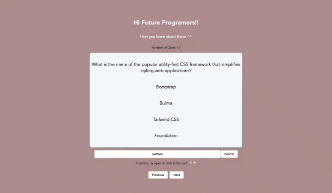

# Web Development Project 2 - *Card Flip*

Submitted by: **Han Luu**

This web app: **Create flashcards web app that users can use to study, learn something new, or play a guessing game. Users will be able to study cards in a randomized order.**

Time spent: **5** hours spent in total

## Required Features

The following **required** functionality is completed:

- [x] **The title of the card set and some information about it, such as a short description and the total number of cards are displayed**
- [x] **A single card at a time is displayed, only showing one of the components of the information pair**
- [x] **A list of card pairs is created**
- [x] **Clicking on the card shows the corresponding component of the information pair**
- [x] **Clicking the next button displays a random new card**

The following **required** functionality for version 2 is completed:
- [x]  **The user can enter their guess in a box before seeing the flipside of the card**
- [x] **Clicking on a submit button shows visual feedback about whether the answer was correct or incorrect**
- [x] **A back button is displayed on the card and can be used to return to the previous card in a set sequence**
- [x] **A next button is displayed on the card and can be used to navigate to the next card in a set sequence**
## Video Walkthrough

Here's a walkthrough of implemented required features:
